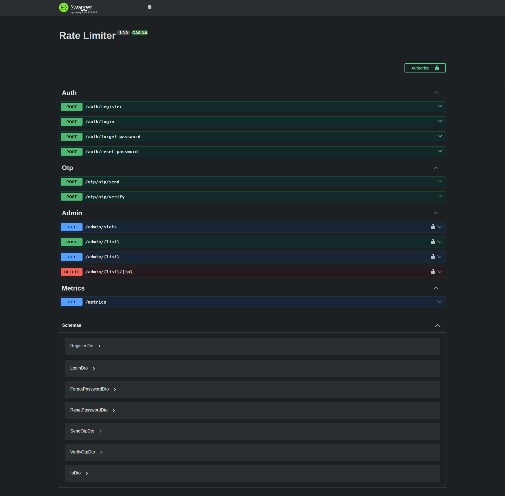
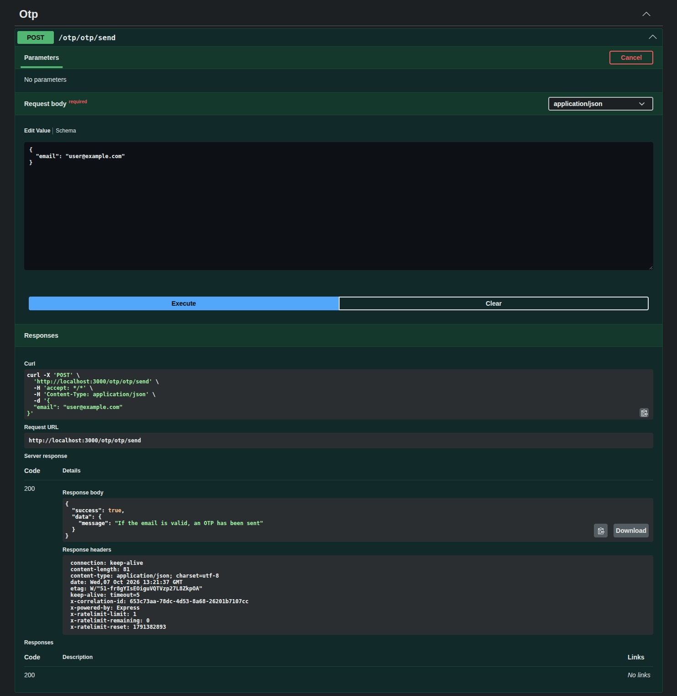
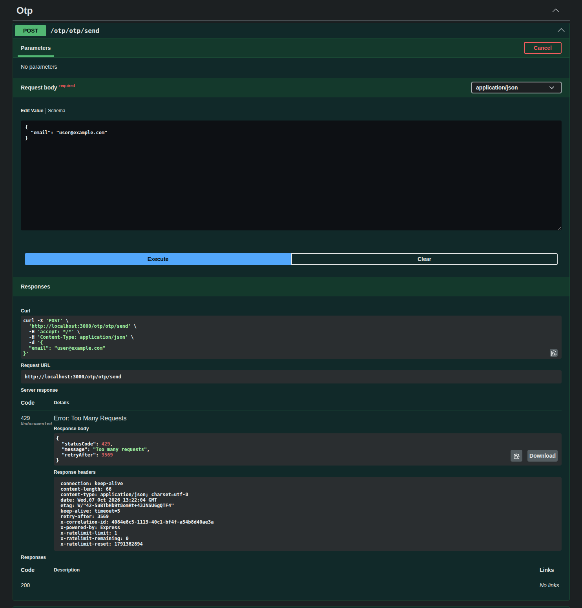
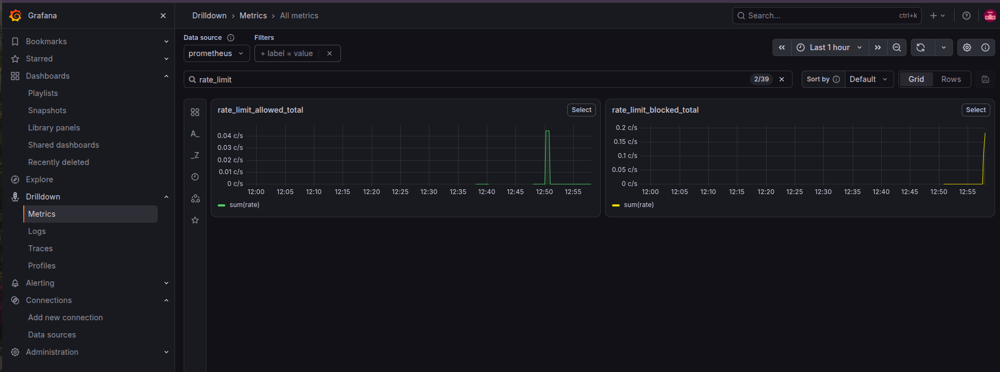

# Rate Limiter Middleware for NestJS

[](https://github.com/seema24jauhari/rate-limiter/actions/workflows/ci.yml)

A reusable rate limiting library for NestJS. Protect any endpoint with a single decorator:

## Screenshots

### Swagger UI


### Response




### Grafana dashboard


```ts
@RateLimit({ limit: 3, window: 3600, keyBy: 'ip' })
@Post('register')
register() {}
```

Counting is done in **Redis using Lua scripts**, so it stays accurate even with thousands of simultaneous requests (no race conditions).

## Features

- `@RateLimit({ limit, window, keyBy })` decorator
- Sliding window algorithm (Redis Sorted Set + Lua)
- Token bucket algorithm (Redis Hash + Lua)
- Key by IP, email or phone
- Standard `X-RateLimit-*` response headers and `429` with `Retry-After`
- Fail-open when Redis is down (availability over strict limiting)
- Whitelist / blacklist and admin API
- Prometheus metrics
- Swagger docs, Docker support, Jest tests, CI/CD

## How it works

```
Client request
      |
      v
Controller (@RateLimit rules attached by the decorator)
      |
      v
RateLimitInterceptor (runs before the controller)
  1. reads the rules
  2. builds the key (e.g. rate_limit:/auth/register:192.168.1.1)
      |
      v
Redis + Lua script (atomic: remove old entries -> count -> add if allowed)
      |
      +-- count < limit  -> controller runs, 200 OK + X-RateLimit-* headers
      +-- count >= limit -> 429 Too Many Requests + Retry-After
```

| Part | Role |
|---|---|
| Decorator | Declares the rule on an endpoint |
| Interceptor | Enforces the rule before the controller runs |
| Redis | Remembers request counts, shared across app instances |
| Lua script | Makes check + count + add one atomic step |

## Demo endpoints

| Endpoint | Limit | Key | Algorithm |
|---|---|---|---|
| `POST /auth/register` | 3 per hour | IP | Sliding window |
| `POST /auth/login` | 5 per 15 min | Email | Sliding window |
| `POST /otp/send` | 1 per 60 sec | Phone | Token bucket |

Example response when blocked:

```json
{
  "statusCode": 429,
  "message": "Too many attempts. Try in 45 min.",
  "retryAfter": 2700
}
```

Headers returned on every response:

```
X-RateLimit-Limit: 3
X-RateLimit-Remaining: 2
X-RateLimit-Reset: 1720003600
```

## Tech stack

NestJS, TypeScript, Redis (ioredis), MongoDB (Mongoose), Argon2, Swagger, Winston, Docker, Jest, Prometheus, GitHub Actions.

## Getting started

### Prerequisites

- Node.js 20+
- Docker

### Install

```bash
git clone <your-repo-url>
cd rate-limiter
npm install
```

### Start Redis and MongoDB

```bash
docker run -d --name redis -p 6379:6379 redis
docker run -d --name mongo -p 27017:27017 mongo
```

### Environment variables

Create a `.env` file in the project root:

```
PORT=3000
MONGO_URI=mongodb://localhost:27017/rate-limiter
REDIS_HOST=localhost
REDIS_PORT=6379
```

### Run

```bash
npm run start:dev
```

Open the Swagger UI at `http://localhost:3000/api/docs` and try the endpoints.

### Test the limiter

```bash
for i in 1 2 3 4; do
  curl -i -X POST localhost:3000/auth/register \
    -H "Content-Type: application/json" \
    -d '{"name":"Seema","email":"seema@test.com","password":"Pass123!"}'
done
```

Calls 1 to 3 return `200`, call 4 returns `429`.

## Project structure

```
src/
  algorithms/
    sliding-window.ts
    token-bucket.ts
  decorators/
    rate-limit.decorator.ts
  interceptors/
    rate-limit.interceptor.ts
  redis/
    redis.module.ts
    redis.service.ts
    lua-scripts/
      sliding-window.lua
      token-bucket.lua
  auth/                     # demo endpoints
    dto/
    schemas/
    auth.controller.ts
    auth.service.ts
  metrics/
    prometheus.service.ts
test/
  sliding-window.spec.ts
  token-bucket.spec.ts
docker-compose.yml
.github/workflows/ci.yml
```

## Sliding window Lua script

```lua
local key = KEYS[1]
local now = tonumber(ARGV[1])
local window = tonumber(ARGV[2])
local limit = tonumber(ARGV[3])
local member = ARGV[4]

redis.call("ZREMRANGEBYSCORE", key, 0, now - window * 1000)
local count = redis.call("ZCARD", key)

if count < limit then
  redis.call("ZADD", key, now, member)
  redis.call("EXPIRE", key, window)
  return 1   -- allowed
else
  return 0   -- blocked (429)
end
```

## Architecture decisions

- **ADR-001: Lua over MULTI/EXEC.** Lua scripts run atomically in Redis. MULTI/EXEC does not let you make decisions between commands, so concurrent requests can slip through.
- **ADR-002: Sliding window over fixed window.** A fixed window allows bursts at the window boundary (for example 2x the limit across two windows).
- **ADR-003: Fail-open on Redis failure.** If Redis is down, requests are allowed and an error is logged, so the limiter never takes down the API.
- **ADR-004: Interceptor over middleware.** Each endpoint has its own rule, and only an interceptor can read the decorator metadata of the handler that will run.

## Scripts

```bash
npm run start:dev    # run in watch mode
npm run build        # compile
npm run test         # unit tests
npm run lint         # lint
```

## Load Test

Load tested with [autocannon](https://github.com/mcollina/autocannon) against `POST /auth/login`, which is limited to 5 attempts per 15 minutes per email (sliding window).

**Setup:** 10 concurrent connections, 10 seconds, local machine, Redis in Docker.
**Run it yourself:** `npm run loadtest`

| Metric | Result |
|---|---|
| Total requests | 14,232 |
| Allowed (within limit) | `<from /metrics>` |
| Blocked (`429`) | `<from /metrics>` |
| Avg latency | 6.53 ms |
| p99 latency | 17 ms |
| Max latency | 54 ms |
| Avg throughput | ~1,423 req/s |

Only the first 5 requests were allowed, even with 10 simultaneous connections. This confirms that the Lua script is atomic and has no race condition under concurrent load. The test user is not registered, so allowed requests return `401` and blocked requests return `429`, which is why autocannon shows 0 `2xx` responses.

<details>
<summary>Raw autocannon output</summary>

```
Running 10s test @ http://localhost:3000/auth/login
10 connections

┌─────────┬──────┬──────┬───────┬───────┬─────────┬─────────┬───────┐
│ Stat    │ 2.5% │ 50%  │ 97.5% │ 99%   │ Avg     │ Stdev   │ Max   │
├─────────┼──────┼──────┼───────┼───────┼─────────┼─────────┼───────┤
│ Latency │ 3 ms │ 6 ms │ 14 ms │ 17 ms │ 6.53 ms │ 3.36 ms │ 54 ms │
└─────────┴──────┴──────┴───────┴───────┴─────────┴─────────┴───────┘
┌───────────┬────────┬────────┬────────┬────────┬─────────┬────────┬────────┐
│ Stat      │ 1%     │ 2.5%   │ 50%    │ 97.5%  │ Avg     │ Stdev  │ Min    │
├───────────┼────────┼────────┼────────┼────────┼─────────┼────────┼────────┤
│ Req/Sec   │ 1,034  │ 1,034  │ 1,326  │ 2,007  │ 1,423.2 │ 317.79 │ 1,034  │
├───────────┼────────┼────────┼────────┼────────┼─────────┼────────┼────────┤
│ Bytes/Sec │ 484 kB │ 484 kB │ 621 kB │ 940 kB │ 666 kB  │ 149 kB │ 484 kB │
└───────────┴────────┴────────┴────────┴────────┴─────────┴────────┴────────┘

0 2xx responses, 14232 non 2xx responses
14k requests in 10.02s, 6.66 MB read
```

</details>

## Roadmap

- ✅ NestJS setup, Redis and MongoDB connection
- ✅ Register and login endpoints with DTO validation
- ✅ Swagger docs
- ✅ Sliding window Lua script
- ✅ `@RateLimit()` decorator and interceptor
- ✅ Token bucket Lua script
- ✅ `X-RateLimit-*` headers
- ✅ Whitelist / blacklist and admin API
- ✅ Prometheus metrics and Grafana dashboard
- ✅  Jest tests, Docker Compose, GitHub Actions
- [ ] Publish to npm

## License

MIT